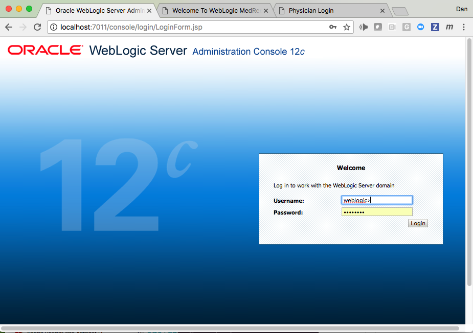
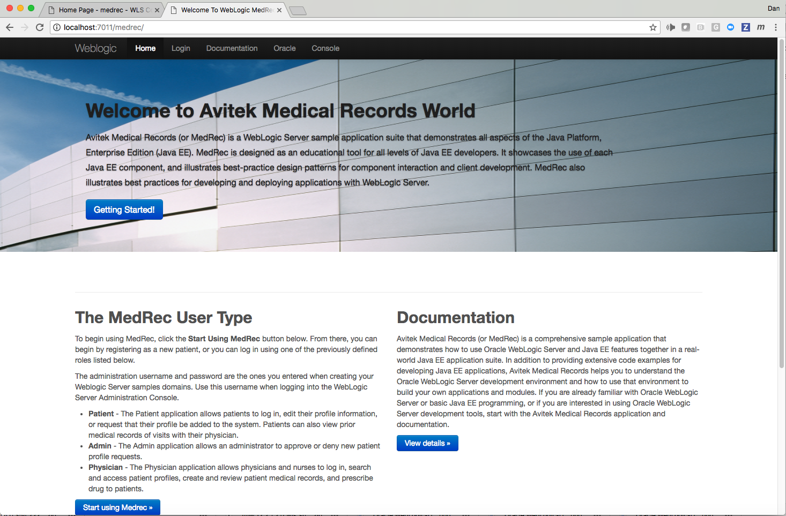
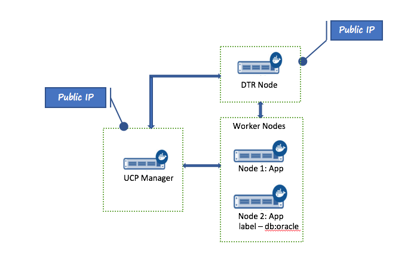
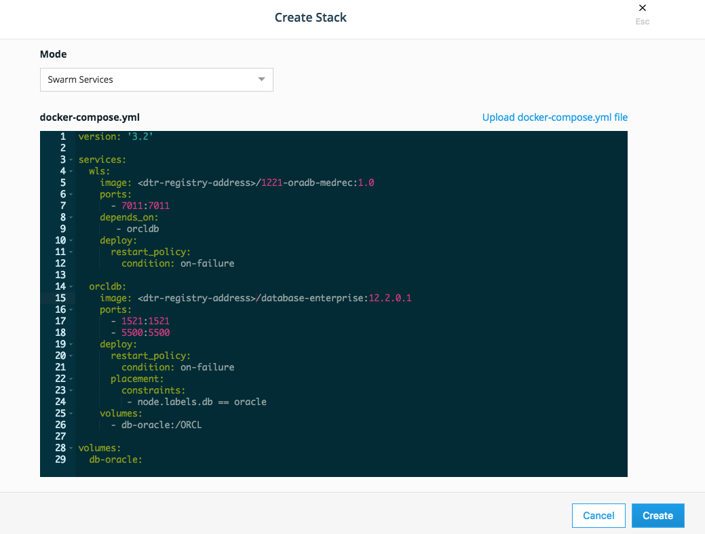
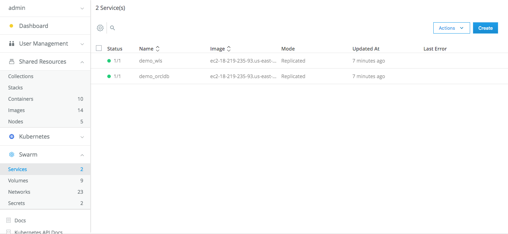
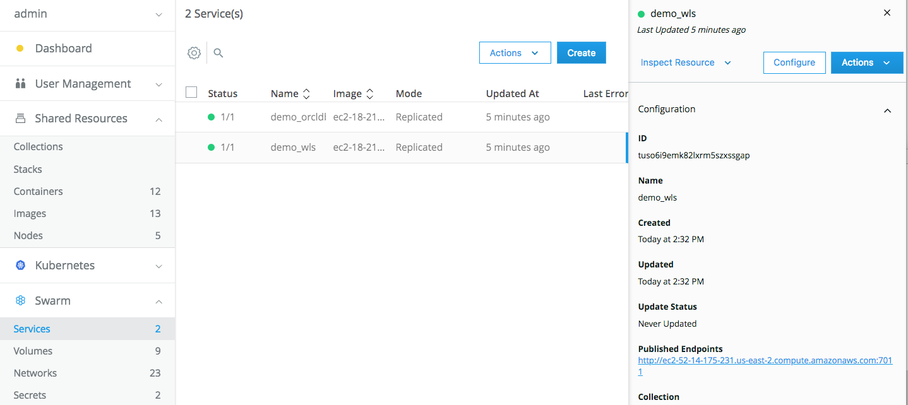
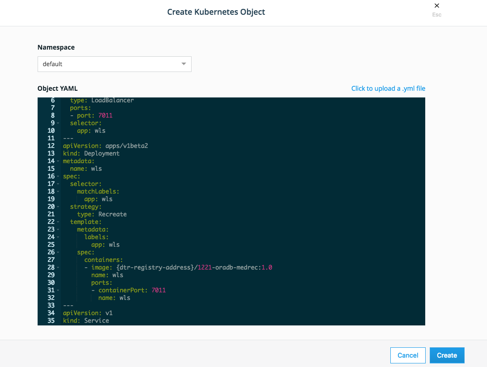
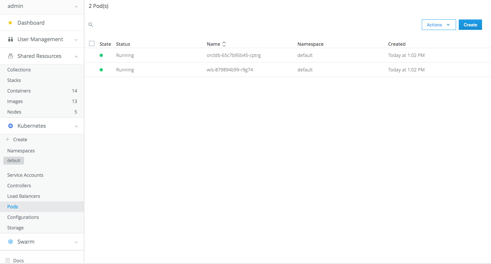
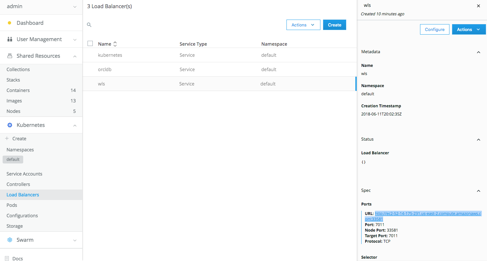

## Overview

This guide illustrates how Docker Enterprise Edition (EE) is used to deploy Oracle Weblogic Server running the MedRec sample application with the Oracle Database.

This Dockerfile extends the Oracle WebLogic image _[Oracle official Weblogic docker project](https://github.com/oracle/docker-images/OracleWeblogic)._ by installing the Supplemental package of WebLogic which includes the MedRec WLS sample and some additional changes to automate build and populate Oracle DB 

The docker-compose file provides an easy way to deploy and run Weblogic/Medrec and Oracle Database containers.

## Oracle Weblogic Overview

Oracle Weblogic is a scalable, enterprise-ready J2EE-based application server for developing and deploying multi-tier distributed enterprise applications. Weblogic server provides enterprise-level security and administration tools for ease of managing the applications.

Oracle Database is a database management system widely used in enterprises for running OLTP, DW, and mixed database workloads. It’s a relational database management system that provides an open, comprehensive, and integrated approach to information management.

Tighter integrations between Weblogic and Oracle database provides a strong infrastructure to develop and test application with improved availability, better resource sharing, ease of configuration, and automated management facilities. As Weblogic and Oracle database are now running in containers, developers and enterprises can take advantage of Docker’s benefits of container isolation, portability, ability to automate development, and testing of these applications.

MedRec (Avitek Medical Records Application) is an end-to-end sample Java EE application shipped with WebLogic Server that simulates an independent, centralized medical record management system. The MedRec application provides a framework for patients, doctors, and administrators to manage patient data using a variety of different clients. MedRec demonstrates WebLogic Server and Java EE features, and it highlights Oracle-recommended best practices. MedRec is installed in the WebLogic Server distribution. It has been used as a reliable and realistic application performance benchmark for over 10 years.

Oracle WLS and Oracle Database are certified to run on Docker containers, and images are available in the [Docker Store](https://store.docker.com).

## Architecture

The following diagram shows Oracle Weblogic, Oracle Database, and MedRec application architecture on Docker Enterprise Edition:


## Test Environment and Components

- <https://github.com/docker/docker-for-oracle-weblogic>
- [Create Docker Store Login](https://store.docker.com/signup?next=%2F)
- [Create Oracle OTN login](https://login.oracle.com/oaam_server/login.do)
- [Docker Enterprise Edition 2.0, UCP 3.0.1, DTR 2.5.1 for Ubuntu](https://store.docker.com/editions/enterprise/docker-ee-server-ubuntu)  (other platforms available)
- Oracle
  - [WebLogic: 12.2.1.2](https://store.docker.com/images/oracle-weblogic-server-12c)
  - [Oracle Database Enterprise Edition: 12.2.0.1](https://store.docker.com/images/oracle-database-enterprise-edition)
  - [SQLcl 4.2](http://www.oracle.com/technetwork/developer-tools/sqlcl/downloads/index.html)
  - [Oracle WebLogic Server 12.2.1.2 Supplemental Quick Installer](http://www.oracle.com/technetwork/middleware/weblogic/downloads/wls-for-dev-1703574.html)

## Installation and Configuration (Docker for Mac)

1. Install the Git utility if not already installed. In a terminal window, navigate to the folder you would like to place the repository (or create a new one), then run the command:

    ```bash
    $ git clone https://github.com/docker/docker-for-oracle-weblogic
    ```
2. Download the [Oracle WebLogic Server 12.2.1.2 Supplemental Quick Installer](http://www.oracle.com/technetwork/middleware/weblogic/downloads/wls-for-dev-1703574.html) (`fmw_12.2.1.2.0_wls_supplemental_quick_Disk1_1of1.zip`), and place the zip file (without extracting it) into current folder.

3. Download the [Oracle SQL Developer command-line (SQLcl) tool](http://www.oracle.com/technetwork/developer-tools/sqlcl/downloads/sqlcl-relnotes-181-4428006.html) (`sqlcl-17.4.0.354.2224-no-jre.zip`), and place the zip file (without extracting it!) into current folder.

4. The Dockerfile uses the Weblogic and Database images from [Docker Store](https://store.docker.com). No modifications are necessary.

5. (Optional) If there are changes to DB username/password, edit the `docker-for-oracle-weblogic/container-scripts/oradatasource.properties` file, and set the Oracle Thin XA driver, the Database URL, username, password, and DB container name to connect to the Oracle Database container.

    ```
    domainname=medrec
    domainhome=/u01/oracle/wlserver/samples/domains/medrec
    admin_name=MedRecServer
    dsname=MedRecGlobalDataSourceXA
    dsdbname=ORCLCDB
    dsjndiname=jdbc/MedRecGlobalDataSourceXA
    dsdriver=oracle.jdbc.xa.client.OracleXADataSource
    dsurl=jdbc:oracle:thin:@orcldb:1521:ORCLCDB
    dsusername=sys as sysdba
    dspassword=Ora_docdb1
    dstestquery=SELECT * FROM DUAL
    dsmaxcapacity=1
    ```

## Create the MedRec Docker Image

1. Make sure you have logged into Docker Store/Hub:

    ```docker
    $ docker login
    ```

2. Build MedRec Image (extending Weblogic Image)

    ```docker
    $ ./build.sh
    ```

## Verifying the Deployment for Swarm on Docker for Mac

   *(If using Kubernetes, proceed to "Verifying the Deployment for Kubernetes on Docker for Mac")*

   To deploy on Docker for Mac using Swarm Orchestrator, execute:

   ```docker
    $ docker compose up -d 
      Creating docker-for-oracle-weblogic_orcldb_1 ... done
      Creating docker-for-oracle-weblogic_wls_1    ... done
    ```

   Startup progress can be monitored by viewing the logs. It may take 5 or 6 minutes (depending on cpu/memory config) for the application to be ready to test

    ```
    $ docker ps
    CONTAINER ID   IMAGE                                       COMMAND                  CREATED             STATUS 
    1b934b0f140c   1221-oradb-medrec:1.0                       "startSample.sh"         2 minutes ago       Up 2 minutes 
    dc9a4f123bcf   store/oracle/database-enterprise:12.2.0.1   "/bin/sh -c '/bin/ba…"   2 minutes ago       Up 2 minutes (healthy)
    ```

## Verifying the Deployment for Kubernetes on Docker for Mac

   If Kubernetes is not already enabled, access the top menu bar of your desktop and click on ```Preferences```. Click on ```Kubernetes``` and choose the ```Enable Kubernetes``` check box. Click on ```Apply``` Docker for Mac now restarts with Kubernetes enabled.

   To deploy with the Kubernetes orchestrator, execute:

   ```
   kubectl create -f wls-oracle.yaml
   service "wls" created
   deployment "wls" created
   service "orcldb" created
   deployment "orcldb" created
   ```

   This starts two services and two deployments named medrec and orcldb. Verify the Kubernetes deployment using the kubectl get command. The output is similar to this:

   ```
   kubectl get pods
   NAME                      READY     STATUS    RESTARTS   AGE
   orcldb-575b6d95d9-n5f4r   1/1       Running   0          42s
   wls-fdddbfcb8-997fg       1/1       Running   0          42s
   ```

   ```
   kubectl get deployments
   NAME      DESIRED   CURRENT   UP-TO-DATE   AVAILABLE   AGE
   orcldb    1         1         1            1           11m
   wls       1         1         1            1           11m
   ```

   ```
   kubectl get services
   NAME         TYPE           CLUSTER-IP       EXTERNAL-IP   PORT(S)             AGE
   kubernetes   ClusterIP      10.96.0.1        <none>        443/TCP             7d
   orcldb       ClusterIP      10.97.195.134    <none>        1521/TCP,5500/TCP   10m
   wls          LoadBalancer   10.111.246.133   localhost     7011:30035/TCP      10m
   ```

## Verifying the Application on Docker for Mac

Access the application, Weblogic Console and Medrec servers:

    Verify access to the WebLogic Console:

    ```
    http://localhost:7011/console
    ```

    

5. Login with the credentials `weblogic/welcome1`:

    

## Test the MedRec Application

Access the MedRec application at:

```
http://localhost:7011/medrec
```



## Stopping the Application using Swarm on Docker for Mac

To stop the application containers, execute:

```docker
$ docker-compose down
Stopping wls-medrec ... done
Stopping orcldb     ... done
Removing wls-medrec ... done
Removing orcldb     ... odone
```

(Proceed to "Configuration and Deployment on Docker Enterprise Edition")


### Stopping the Application using Kubernetes on Docker for Mac

To stop the application, execute:

   ```
   kubectl delete svc orcldb wls
   service "orcldb" deleted
   service "wls" deleted
   ```

   ```
   kubectl delete deployments
   deployment "orcldb" deleted
   deployment "wls" deleted
   ```


##  Configuration and Deployment on Docker Enterprise Edition

To deploy the Oracle Weblogic and Oracle Database Solution Brief on Docker Enterprise Edition 2.0, begin with the provisioning of an appropriate number of nodes for site-specific performance and high availability. As an example for this Solution Guide, a four instance deployment was provisioned consisting of one instance for UCP Management and three worker containers.  UCP manages both Kubernetes and Swarm orchestration.

Docker Trusted Registry (DTR) is also installed on the instance with one of the worker containers. This guide assumes that UCP and DTR have been installed and configured and that access to the "admin" account and password have been provided.

### Docker EE Swarm Configuration

This section shows how to deploy a 4-node (non-HA) Oracle WebLogic stack using Docker Enterprise Edition (Docker swarm) on Oracle Cloud Infrastructure (OCI). Instructions for AWS are also included.

> **Note:** A High Availability configuration should be used in a production environment.



> **Note:** A label has been added to the node in this digram to identify the Oracle Database node. Proper functioning of the database requires 2-4 CPUs, 8-16GB memory, and 12-16GB local storage.

An example `docker-compose-EE.yml` is provided below which brings up the WebLogic console and launch the MedRec application. Details can be found at [MedRec applications on Weblogic with Oracle Database](https://github.com/docker/docker-for-oracle-weblogic).

`Before proceeding with the `docker-compose` deployment, move the `1221-oradb-medrec` image to an internally accessible Docker Trusted Registry using `docker tag` and `docker push` commands. The address of the registry will be entered into the `docker-compose-EE.yml` at `{dtr-registry-address}`.

Copy the `docker-compose-EE.yml` below into a text or code editor.

```yml
version: '3.2'

services:
  wls:
    image: <dtr-registry-address>/1221-oradb-medrec:1.0
    ports:
      - 7011:7011
    depends_on:
       - orcldb

  orcldb:
    image: {dtr-registry-address}/database-enterprise:12.2.0.1
    ports:
      - 1521:1521
      - 5500:5500
    deploy:
      placement:
        constraints:
         - node.labels.db == oracle
```


### Define the Persistent Volumes

To deploy Weblogic and Oracle database on local volumes, proceed to **Verifying the Install**. The local volumes will not persist if the service is removed or fails.

To set up persistent volumes, subscribe to an appropriate volume plugin from the Docker Certified Plugin list at [store.docker.com](https://store.docker.com).  This example uses [EMC’s Rex-ray for AWS/EBS](https://store.docker.com/plugins/rex-ray-for-aws-ebs).

To use AWS EBS, obtain an access id and secret key from AWS IAM service by following the directions at [https://docs.aws.amazon.com/general/latest/gr/aws-sec-cred-types.html](https://docs.aws.amazon.com/general/latest/gr/aws-sec-cred-types.html).

Install the plugin with the following commands using the `EBS_ACCESSKEY` obtained in the previous step.

```
docker plugin install rexray/ebs EBS_ACCESSKEY=mykey EBS_SECRETKEY=mysecretkey
```

This table shows the services needed to define the persistent volume

| Volume Name | Service | Container Mount point |
|:------------|:--------|:----------------------|
| db-oracle  | orcldb  | /ORCL                 |


Within UCP, click on the **Volumes** selection that appears in the left hand side bar. Click on **Create Volumes**, and enter the information in the table above.

```
Name: db-oracle
Driver: rexray/ebs
```

In the text or code editor, add the following lines to the `docker-compose-EE.yml`


```
    volumes:
      - db-oracle:/ORCL

volumes:
  db-oracle:
    driver: rexray/ebs

```

Change the `{dtr-registry-address}` fields for the installation of DTR or Docker Hub.

Copy the entire contents into the clipboard.  Be sure to preserve indentation layout.


## Verifying the Deployment (Docker EE) via UCP UI Swarm

1. Access the URL for the UCP management node and login as `admin`.
2. Within UCP, click on the **Stacks** selection that appears in the left hand side bar.
3. Click on **Create Stack**. Provide a name for the Stack (Ex. ```demo```) and Mode (Choose **Swarm Services**).
4. Paste in the edited `docker-compose-EE.yml` commands from the clipboard.
5. Finally, click on the `Create` button to deploy the stack.


6. To verify that the containers launched successfully, click on **Services** in the left side bar on the UCP home screen. The 2 services `demo_wls`, `demo_orcldb` should show with green status and no errors.


7. To bring up the application, click on ```Services``` in the Swarm section on the left hand bar. Choose ```demo-wls``` in the list of load balancers. Choose the address **Published Endpoints** to bring up the Oracle Weblogic and Medrec screen. Add "/console/" to the URL in the browser to bring up WebLogic screen, and add "/medrec/" to the URL in the browser to bring up Medrec application.



## Verifying the Deployment (Docker EE) via Client Bundle

To launch and verify the installation, download client bundle from the UCP UI (**admin**-->**My Profile**-->**New Client Bundle**), navigate to the directory and unzip `ucp-bundle-admin.zip`. Copy `docker-compose-EE.yml` to this directory, and execute the following commands:

**Note:** If pulling image from Docker Store, add the `--with-registry-auth` option to `docker stack deploy`.

```bash
source env.sh
docker stack deploy -c docker-compose-EE.yml <stack name>
```

Example Output:


```bash
$ source env.sh
$ docker stack deploy --compose-file docker-compose-EE.yml demo
...
Creating network demo_default
Creating service demo_orcldb
Creating service demo_wls
```


## Verifying the Deployment (Docker EE) via UCP UI Kubernetes

1. In a browser, access the UCP management node and login
2. Click on ```Kubernetes``` in the left hand bar and then click ```+Create```
3. On the ```Create Kubernetes Object``` screen, choose ```default``` in the Namespace dropdown menu. From the ```sample``` directory, upload the file ```weblogic-oracledb-Kubernetes-EE.yaml```. Change {dtr-registry-address} to the actual address name of the Docker Trusted Registry. Click ```Create``` to launch the deployment. 


4. To verify that the containers lauched successfully, click on ```Pods``` in the left side bar on the UCP home screen. The ```wls``` and ```orcldb``` show with green status and no errors.


5. To bring up the application, click on ```Load Balancers``` in the Kubernetes section on the left hand bar. Choose ```wls``` in the list of load balancers. A configuration bar appears on the right. Choose the address with port 33581 to bring up the Oracle Weblogic and Medrec screen. Add "/console/" to the URL in the browser to bring up WebLogic screen, and add "/medrec/" to the URL in the browser to bring up Medrec application.


### Stopping the Application on Enterprise Edition using Swarm

To stop the solution using UI, click on ```Stacks``` in the left hand bar and then click on the **Name** of the stack. A menu bar appears on the right. Click on **Remove** to stop and remove the containers.

To stop the solution and remove the stack using Client Bundle

```bash
$ docker stack rm demo
```

### Stopping the Application on Enterprise Edition using Kubernetes

To stop the solution, click on ```Kubernetes```, then ```Controller``` delete entries for wls and orcldb. Also remove ```Load Balancer``` entries for the same.

## Troubleshooting

Depending on your deployment circumstances, it may be necessary to list the {dtr-registry-address} in the Docker "insecure registries" table found under Preferences -> Daemon in the menu of the Docker toolbar icon). If you receive certificate errors, this is a likely cause.

Make sure that the Nodes listed in the Shared Resources tab have the correct mix of Kubernets, Swarm, or Mixed resources available.

DTR certificates: In the case of a new EE installation, the docker push` does not work, by default, with registry endpoint that has self-signed TLS certificate. 

Configure nodes as per the doc. to deploy services to Docker UCP from images stored in DTR: 
https://docs.docker.com/datacenter/ucp/2.2/guides/admin/configure/integrate-with-dtr/#2-test-your-local-setup

Most Docker-related monitoring and troubleshooting can be accomplished by viewing the logs for service or by going to the specific node and searching for the container ID:

For a service, first, find the service ID:

```
docker service ls
```

Then, view the logs for that service ID:

```
docker service logs <service ID>
```

For a container, find the container ID:

```
docker ps
```

Then view the logs for that container:

```
docker logs <container ID>
```

## Further Reading

Here's the link to learn more about Oracle Weblogic and other Oracle images for Docker:

- [Docker Store Oracle WebLogic Server Image](https://store.docker.com/images/oracle-weblogic-server-12c "Docker Store Oracle WebLogic")
- [Docker Store Oracle Database Enterprise Edition Image](https://store.docker.com/images/oracle-database-enterprise-edition "Docker Store Oracle Database EE")
- [Official source for Docker configurations, images, and examples of Dockerfiles for Oracle products and projects](https://github.com/oracle/docker-images)  
- [Test and Deploy Weblogic and Oracle Database on Docker](https://blogs.oracle.com/developers/test-and-deploy-weblogic-and-oracle-database-applications-on-docker)

##  Additional Solution Briefs

- [Oracle Weblogic 12c Solution Brief for Docker EE 17.06](https://success.docker.com/article/oracle-weblogic/)
- [IBM Security Access Manager v9.0.4 Solution Brief for Docker EE 17.06](https://success.docker.com/article/ibm-isam-security/)
- [Cisco Contiv 1.1.7 Solution Brief for Docker EE 17.06](https://success.docker.com/article/contiv-networking/)
- [VMware VSphere Storage for Docker 2.2.1 Solution Briefing for Docker EE 17.06](https://success.docker.com/article/vsphere-storage/)
- [Splunk Enterprise Solution Brief for Docker EE 17.06](https://success.docker.com/article/splunk-logging/)
- [Grafana/Prometheus Monitoring Solution Brief for Docker EE 17.06](https://success.docker.com/article/grafana-prometheus-monitoring/)
- [NGINX Solution Brief on Docker EE 17.06](https://success.docker.com/article/nginx-load-balancer/)
